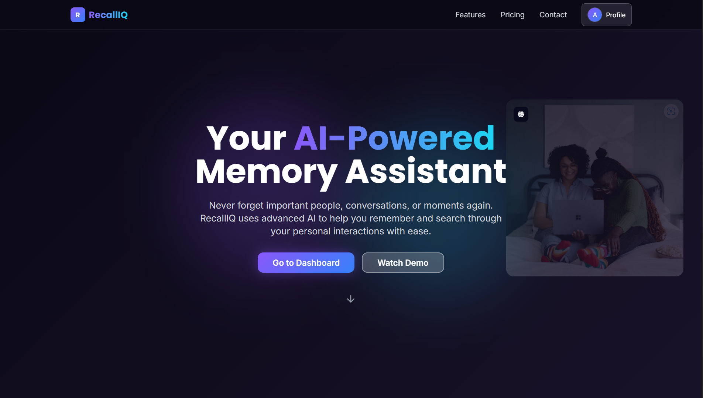
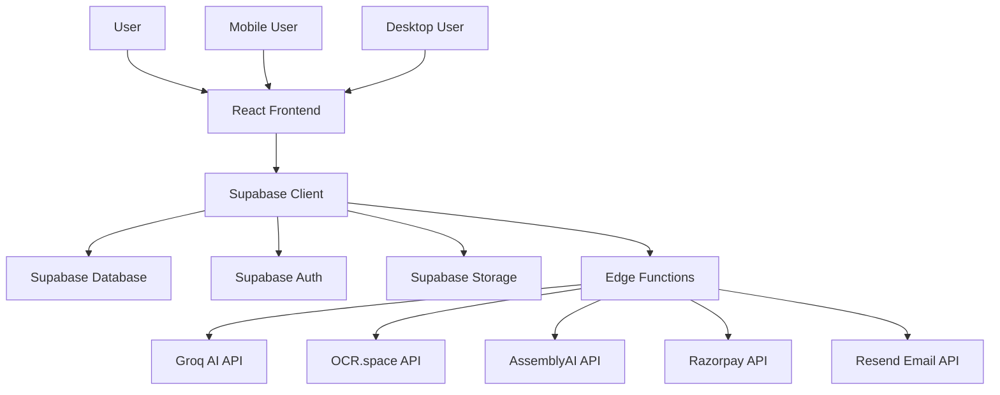
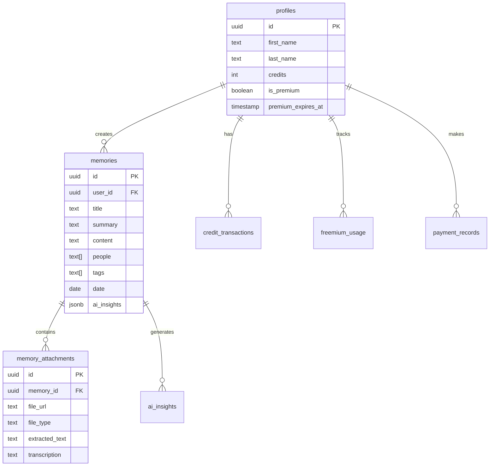
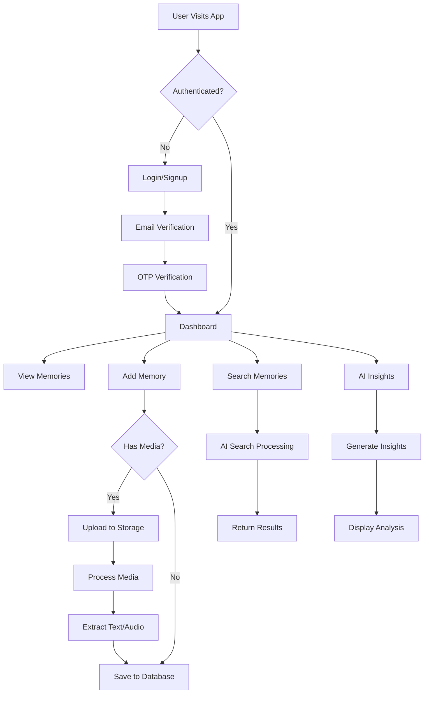

# 🧠 RecallIQ - AI-Powered Memory Assistant

<div align="center">
  
  
  [](https://lovable.dev)
  [](https://www.typescriptlang.org/)
  [](https://reactjs.org/)
  [](https://supabase.com/)
  [](https://tailwindcss.com/)

  **Never forget important people, conversations, or moments again**
  
  [🚀 Live Demo](https://recalliq.netlify.app) · [📖 Documentation](https://github.com/Ashutosh102/recalliq/edit/main/README.md) · [🐛 Report Bug](https://github.com/Ashutosh102/recalliq/issues)
</div>

---

## 🌟 Features

### 🔥 Core Features
- **🧠 AI-Powered Memory Storage** - Capture people, conversations, and moments with intelligent context
- **🔍 Smart Search** - Natural language queries to find anyone or anything instantly
- **🎨 Interactive Globe Visualization** - 3D visualization of connected memories and relationships
- **📱 Responsive Design** - Seamless experience across all devices
- **🔒 Secure Authentication** - Email verification with OTP-based security
- **💳 Integrated Payments** - Razorpay integration for premium features

### ⚡ Advanced Capabilities
- **🎤 Audio Recording** - Voice memo capture with automatic transcription
- **📄 OCR Processing** - Extract text from images and documents
- **🤖 AI Insights** - Get intelligent summaries and connections between memories
- **🏷️ Smart Tagging** - Automatic categorization and manual tagging
- **📊 Credit System** - Freemium and premium tiers with usage tracking
- **🔗 Media Attachments** - Support for images, audio, and documents

---

## 🎨 Design System

### Color Palette
```css
/* Primary Colors */
--purple-primary: #8B5CF6    /* Main brand color */
--teal-accent: #22D3EE       /* Secondary accent */
--blue-neon: #3B82F6         /* Highlight color */

/* Background Gradients */
--dark-bg: #0E0B1C           /* Primary background */
--dark-secondary: #1C152E    /* Secondary background */

/* Glass Morphism */
--glass-bg: rgba(255, 255, 255, 0.05)
--glass-border: rgba(255, 255, 255, 0.1)
--glass-backdrop: blur(16px)
```

### Typography
- **Primary Font**: Inter (Sans-serif)
- **Display Font**: Poppins (Headers and titles)
- **Font Weights**: 300, 400, 500, 600, 700

### UI Components
- **Glass Morphism Cards** - Semi-transparent cards with backdrop blur
- **Gradient Buttons** - Animated gradient backgrounds with hover effects
- **Animated Icons** - Lucide React icons with smooth transitions
- **Interactive Elements** - Hover states and micro-interactions

---

## 🛠️ Tech Stack

### Frontend
- **Framework**: React 18 with TypeScript
- **Build Tool**: Vite
- **Styling**: Tailwind CSS with custom design system
- **UI Components**: Shadcn/UI + Custom components
- **Animations**: Framer Motion
- **Icons**: Lucide React
- **3D Graphics**: Three.js with React Three Fiber

### Backend
- **Database**: Supabase (PostgreSQL)
- **Authentication**: Supabase Auth with email verification
- **File Storage**: Supabase Storage
- **Edge Functions**: Supabase Functions (Deno runtime)
- **Real-time**: Supabase Realtime subscriptions

### AI & Integrations
- **AI Provider**: Groq API for fast inference
- **OCR**: OCR.space API for text extraction
- **Speech-to-Text**: AssemblyAI for audio transcription
- **Payments**: Razorpay for Indian market
- **Email**: Resend for transactional emails

### Development & Deployment
- **Package Manager**: npm
- **Version Control**: Git with GitHub integration
- **Deployment**: Lovable hosting platform
- **Environment**: Node.js 18+

---

## 🏗️ Architecture

### System Architecture


### Database Schema


### Application Flow


---

## 🔒 Security Measures

### Authentication & Authorization
- **🔐 Email Verification**: OTP-based email verification system
- **🛡️ Row-Level Security (RLS)**: Database-level access control
- **🔑 JWT Tokens**: Secure session management
- **🚫 Rate Limiting**: Built-in protection against abuse

### Data Protection
- **🔒 Encrypted Storage**: All sensitive data encrypted at rest
- **🌐 HTTPS Only**: All communications over secure connections
- **🔐 API Key Management**: Secure secret management in Supabase
- **🛡️ CORS Protection**: Configured for secure cross-origin requests

### Payment Security
- **💳 PCI Compliance**: Razorpay handles all payment processing
- **🔐 HMAC Verification**: Payment webhook signature verification
- **🛡️ Server-side Validation**: All transactions verified server-side

### Privacy & Compliance
- **🔒 Data Isolation**: User data completely isolated per account
- **🗑️ Data Deletion**: Complete data removal on account deletion
- **📋 Audit Logs**: Transaction and credit usage logging
- **🔐 Secure File Upload**: Validated file types and sizes

---

## 🚀 Getting Started

### Prerequisites
- Node.js 18+ and npm
- Supabase account
- Required API keys (see Environment Variables)

### Installation

1. **Clone the repository**
   ```bash
   git clone https://github.com/Ashutosh102/recalliq.git
   cd recalliq
   ```

2. **Install dependencies**
   ```bash
   npm install
   ```

3. **Set up Supabase**
   - Create a new Supabase project
   - Run the database migrations from `supabase/migrations/`
   - Configure Row-Level Security policies

4. **Configure Environment Variables**
   Set up the following secrets in Supabase Edge Functions:
   ```
   GROQ_API_KEY=your_groq_api_key
   OCR_SPACE_API_KEY=your_ocr_space_key
   ASSEMBLYAI_API_KEY=your_assemblyai_key
   RAZORPAY_KEY_ID=your_razorpay_key_id
   RAZORPAY_KEY_SECRET=your_razorpay_secret
   RESEND_API_KEY=your_resend_api_key
   ```

5. **Start the development server**
   ```bash
   npm run dev
   ```

### Deployment

Deploy to Lovable platform:
1. Connect your GitHub repository
2. Configure environment variables
3. Deploy with one click

---

## 📊 Usage Analytics

### Freemium Limits
- **Memory Saves**: 5 per month
- **Memory Saves with Media**: 2 per month  
- **AI Searches**: 5 per month

### Premium Features
- **Unlimited Memory Storage**
- **Unlimited AI Searches**
- **Advanced Media Processing**
- **Premium Support**
- **Export Capabilities**

---

## 🤝 Contributing

We welcome contributions! Please see our [Contributing Guide](CONTRIBUTING.md) for details.

### Development Workflow
1. Fork the repository
2. Create a feature branch (`git checkout -b feature/amazing-feature`)
3. Commit your changes (`git commit -m 'Add amazing feature'`)
4. Push to the branch (`git push origin feature/amazing-feature`)
5. Open a Pull Request

---

## 📄 License

This project is licensed under the MIT License - see the [LICENSE](LICENSE) file for details.

---

## 🙏 Acknowledgments

- UI components from [Shadcn/UI](https://ui.shadcn.com)
- Icons by [Lucide](https://lucide.dev)
- 3D graphics powered by [Three.js](https://threejs.org)

---

## 📞 Support

- 📧 Email: gotodevashu@gmail.com
- 📖 Documentation: [docs.recalliq.com](https://github.com/Ashutosh102/RecallIQ/blob/main/README.md)
- 🐛 Issues: [GitHub Issues](https://github.com/Ashutosh102/recalliq/issues)

---

<div align="center">
  <p>Made with ❤️ by the RecallIQ Team</p>
  <p>
    <a href="https://lovable.dev">
      
    </a>
  </p>
</div>
